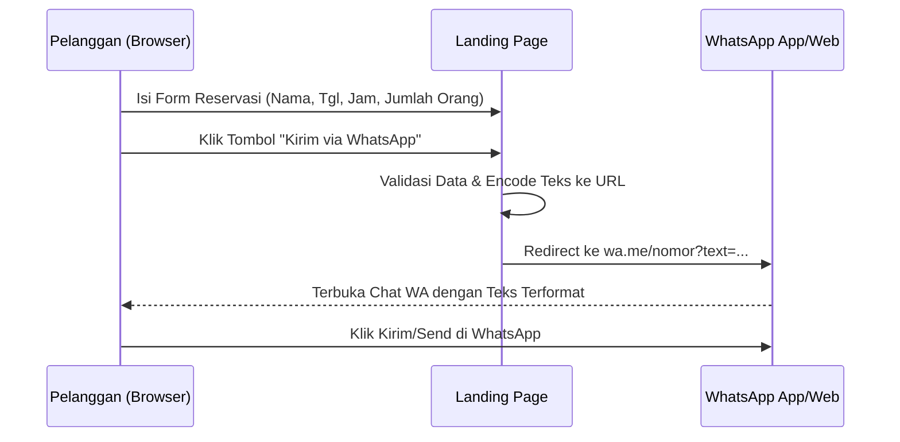
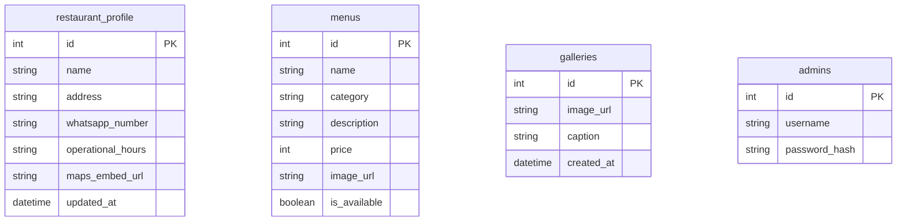

# Project Requirements Document (PRD) — Dynamic Restaurant Landing Page & Admin Panel

## 1. Overview
Proyek ini bertujuan untuk membangun sebuah *landing page* satu halaman (*single-page website*) yang responsif untuk sebuah restoran guna meningkatkan kehadiran digital, menampilkan menu, galeri, lokasi, dan ulasan pelanggan. 

Masalah utama yang ingin diselesaikan adalah mempermudah calon pelanggan melakukan reservasi meja secara instan tanpa sistem yang rumit, yaitu dengan mengubah data formulir di web menjadi templat pesan WhatsApp otomatis. Selain itu, pemilik restoran (Admin) harus dapat mengubah informasi operasional restoran secara mandiri melalui *Admin Panel* khusus tanpa perlu mengubah kode program.

## 2. Requirements & Scope
- **Aksesibilitas:**
  - **Landing Page:** Harus sangat responsif dan ringan saat diakses via *Mobile/Smartphone* (karena mayoritas pelanggan restoran membuka lewat HP).
  - **Admin Panel:** Diutamakan diakses melalui web desktop/laptop untuk kemudahan input data.
- **Pengguna:**
  - **Pelanggan:** Pengunjung umum yang melihat informasi, rute, dan melakukan reservasi.
  - **Admin:** Pemilik atau manajer restoran yang memiliki hak akses penuh (dilindungi login) untuk mengubah konten web.
- **Sistem Reservasi:** Menggunakan integrasi formulir yang otomatis menghasilkan tautan WhatsApp (*WhatsApp API Link*) dengan teks yang sudah terformat rapi.
- **Konten Dinamis:** Detail restoran (alamat, link Google Maps, jam buka), daftar menu, dan foto galeri harus diambil dari database, bukan ditulis mati (*hardcoded*).

## 3. Core Features

### A. Landing Page (Public View)
1. **Hero Section:** Foto/video atmosfer restoran, slogan, dan tombol CTA "Reservasi Sekarang".
2. **Daftar Menu Dinamis:** Menampilkan menu berdasarkan kategori (Makanan, Minuman, Dessert) lengkap dengan foto, nama, deskripsi, dan harga.
3. **Galeri Foto:** Kolase foto suasana restoran (*indoor/outdoor*) yang bisa diperbarui dari admin.
4. **Google Maps & Review:**
  - *Embed* Google Maps interaktif untuk lokasi restoran.
  - Bagian testimoni/ulasan yang dinamis atau di-input oleh admin.
5. **Formulir Reservasi WhatsApp:**
   - Input: Nama, Jumlah Tamu, Tanggal, Jam, dan Catatan Khusus.
   - Aksi: Saat tombol "Kirim via WhatsApp" diklik, sistem membuka tautan WhatsApp (`https://wa.me/`) dengan teks yang sudah terformat otomatis sesuai inputan user.

### B. Admin Dashboard (Protected View)
1. **Sistem Login:** Autentikasi aman untuk Admin menggunakan username/email dan password.
2. **Pengaturan Profil Restoran:** Form untuk memperbarui info utama (Nama Restoran, Alamat, Nomor WhatsApp Tujuan, Jam Buka, dan URL Embed Google Maps).
3. **Manajemen Menu (CRUD):** Fitur untuk Menambah, Melihat, Mengubah, dan Menghapus data menu beserta fungsi unggah gambar menu.
4. **Manajemen Galeri:** Fitur untuk mengunggah atau menghapus foto-foto suasana restoran.

## 4. User Flow (WhatsApp Reservation)

## 5. Database Schema

## 6. Technical Constraints & Recommendations
1. **Format Pesan WhatsApp:** Output string dari form harus diubah menggunakan fungsi `encodeURIComponent()` di sisi *client* agar karakter spasi (`%20`) dan baris baru (`%0A`) terbaca dengan benar oleh API WhatsApp.
2. **Keamanan Admin:** Halaman dashboard admin harus diproteksi dengan *session* atau *token* (JWT/Auth), tidak boleh diakses langsung tanpa login.
3. **Recommended Tech Stack for AI Agent:**
   - **Framework:** Next.js (App Router) untuk arsitektur full-stack terpadu.
   - **Database:** SQLite (lokal & ringan) atau Supabase/PostgreSQL (cloud, include Storage untuk file foto).
   - **Styling:** Tailwind CSS untuk efisiensi desain UI mobile-first yang responsif.
   - **ORM:** Prisma untuk manajemen skema dan query database yang modern.
